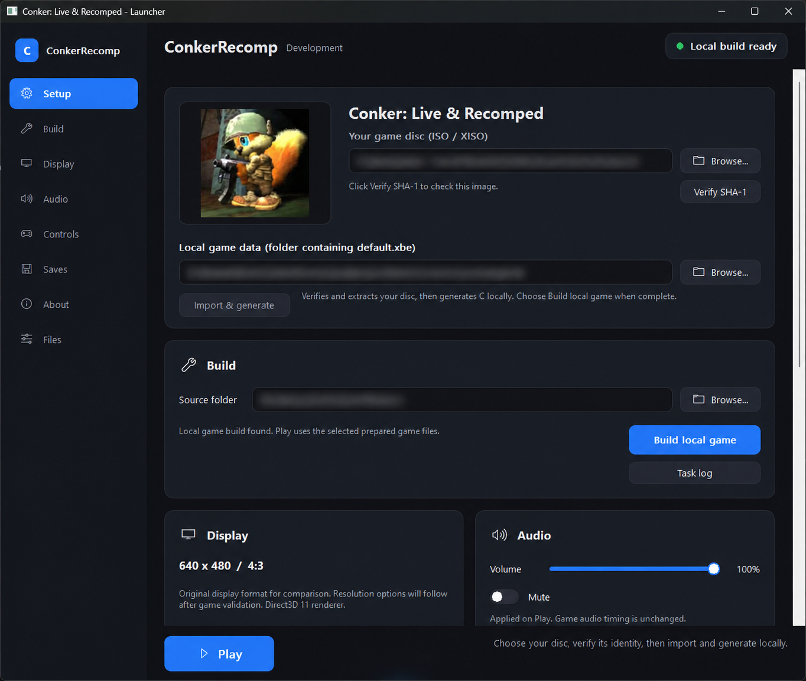
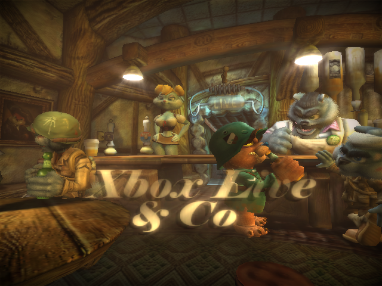
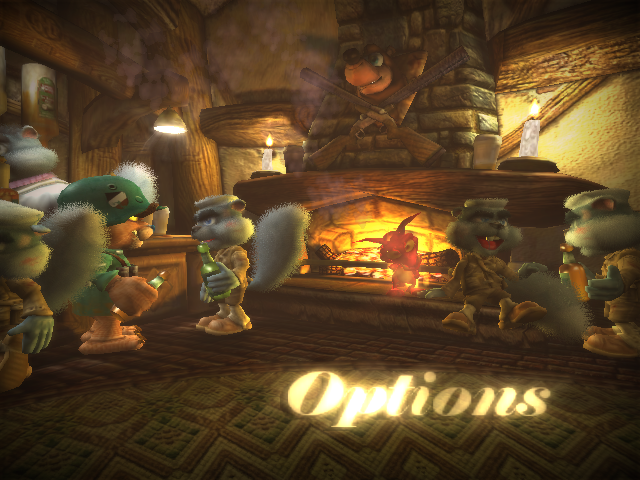
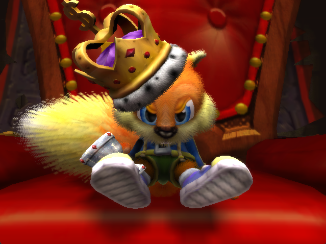
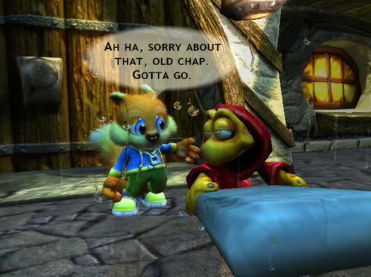
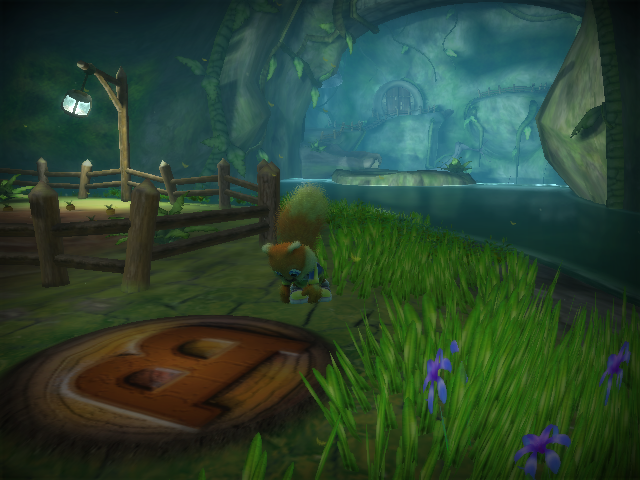
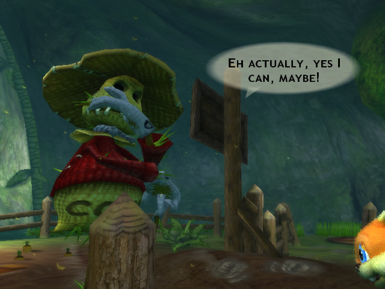
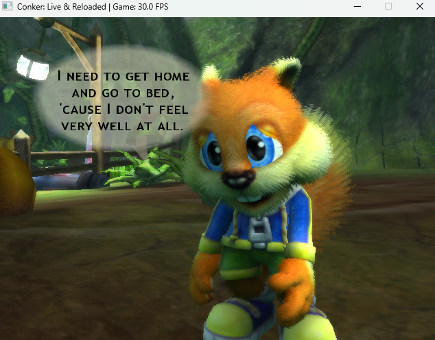

> **Development preview:** The local generation and Windows runtime can run the
> intro and tavern. Import your own recognized ISO, generate C, build locally,
> then test through the launcher. Campaign and multiplayer remain unfinished.
> See [setup and build instructions](docs/DEVELOPMENT.md).

Double-click **[conker-launcher.exe](conker-launcher.exe)** after cloning or
extracting this repository to open the launcher without compiling it.

# Conker: Live & Recomped

### A native Windows recompilation project for *Conker: Live & Reloaded*

**Repository:** `ConkerRecomp`

---

## 🐿️ About

**Conker: Live & Recomped** is an unofficial native recompilation project for the original Xbox release of **Conker: Live & Reloaded**.

The goal is to run the game as a native Windows application while preserving the behavior of the original Xbox game as closely as practical.

This project is **not an emulator** and does **not** distribute the original game, its assets, or extracted game data.

---

## 🎯 Project Goals

- Run **Conker: Live & Reloaded** natively on modern Windows.
- Preserve the original game's logic and behavior through static/native recompilation.
- Replace Xbox-specific platform services with clean Windows-compatible implementations.
- Translate original Xbox graphics behavior to a modern PC rendering backend.
- Support modern PC input, including **keyboard and mouse**.
- Require users to provide their **own original game files**.
- Make the project reproducible, understandable, and maintainable as an open-source effort.

---

## 💿 Game Files

> [!IMPORTANT]
> **No original Conker game files are included in this repository or in planned releases.**

Users will need to provide their own legal copy of **Conker: Live & Reloaded**.

---

## 🚧 Project Status

> [!WARNING]
> **Very early development — not currently ready for normal gameplay.**

The migrated runtime supports the logo/loading/video sequence, outdoor tavern
entrance scene, all six tavern menu positions, controller navigation and audio.
Game code and assets are generated or extracted locally from the user's disc.
Rendering fidelity and performance remain under development; campaign and
multiplayer are the next major areas of work.

---

## 📸 Screenshots

Screenshots from the Windows development build. Rendering and gameplay are
still being refined.

**Launcher**

| Tavern menu | Options |
| --- | --- |
|  |  |

| Story — throne room | Story — outside the tavern |
| --- | --- |
|  |  |

| Gameplay — garden | Gameplay — talking to Birdy |
| --- | --- |
|  |  |

**Campaign — opening dialogue**

These images document the running recomp. All game files and generated code
needed to play are still prepared locally from the user's own disc.

---

## 🖥️ Platform

### Primary target

**Windows x64**

Development currently focuses on Windows first. Other platforms may be considered later, but portability is not currently the priority.

---

## 📁 User Workflow

1. Clone or download ConkerRecomp and install the [build prerequisites](docs/DEVELOPMENT.md).
2. Open `conker-launcher.exe`.
3. Select your own supported Conker ISO / XISO and verify its SHA-1.
4. Select **Import & generate** to extract data and generate C on your PC.
5. Select **Build local game**, then **Play** to test the intro and tavern.

---

## 🚀 Future Goals

Once the recomp reaches a stable, accurate, and playable release, the project can begin expanding beyond basic compatibility.

### Multiplayer

- Restore and support the original multiplayer functionality.
- Investigate modern networking options where appropriate.
- Preserve the original multiplayer gameplay while making it practical to use on modern PCs.

### Mod Support

A stable native PC version creates opportunities for a proper modding ecosystem, including:

- custom content and gameplay modifications;
- easier resource replacement;
- new gameplay features;
- community-made fixes and improvements;
- scripting/tooling where technically practical.

### Enhanced PC Features

Potential post-stability improvements include:

- **HD / higher-resolution rendering**
- **widescreen and ultrawide support**
- higher frame-rate support where game logic allows it
- improved graphics options
- modern controller support
- keyboard and mouse support
- quality-of-life improvements
- optional new features that remain separate from the original-game compatibility path

The first priority remains achieving a stable and accurate recompilation. Enhancements should come **after** the original game is running correctly.

## ⚖️ Legal

**Conker: Live & Recomped / ConkerRecomp is an unofficial fan-made project.**

It is not affiliated with, sponsored by, approved by, or endorsed by **Microsoft**, **Rare**, or any other rights holder associated with *Conker: Live & Reloaded*.

*Conker*, *Conker: Live & Reloaded*, Xbox, and related names, characters, artwork, and game content are the property of their respective owners.

This repository does **not** provide the original game and is intended to require users to supply their own copy of the game.

The project logo and other original repository artwork are intended only to identify this unofficial fan project.

---

### 🐿️ Conker: Live & Recomped

**Native recompilation. Original game required. No game data included.**

Built with a lot of disassembly, debugging, caffeine, and questionable squirrel-related decisions.

---

## 🙌 Special Thanks

This project would not be possible without the work of the following open-source projects and their contributors.

### [XboxRecomp](https://github.com/sp00nznet/xboxrecomp)

**XboxRecomp** provides the core static recompilation foundation used by this project.

A huge thank-you to the XboxRecomp developers and contributors for making this kind of project possible.

### [Xemu](https://github.com/xemu-project/xemu)

**Xemu** has been an essential debugging and behavioral reference throughout development.

Xemu is used as a **debugging/reference tool only**. The finished recomp is not intended to require Xemu.

A huge thank-you to the Xemu team and contributors for their work on original Xbox emulation.

### [CLR_Unpack](https://github.com/birdytsc/clr_unpack)

**CLR_Unpack** is used to unpack and inspect *Conker: Live & Reloaded* resource/package data.

A huge thank-you to the CLR_Unpack author and contributors for making the game's package format easier to study.

> [!NOTE]
> These projects are independent projects. Their inclusion here is an acknowledgment of the tools used during development and does not imply affiliation with or endorsement of ConkerRecomp.
